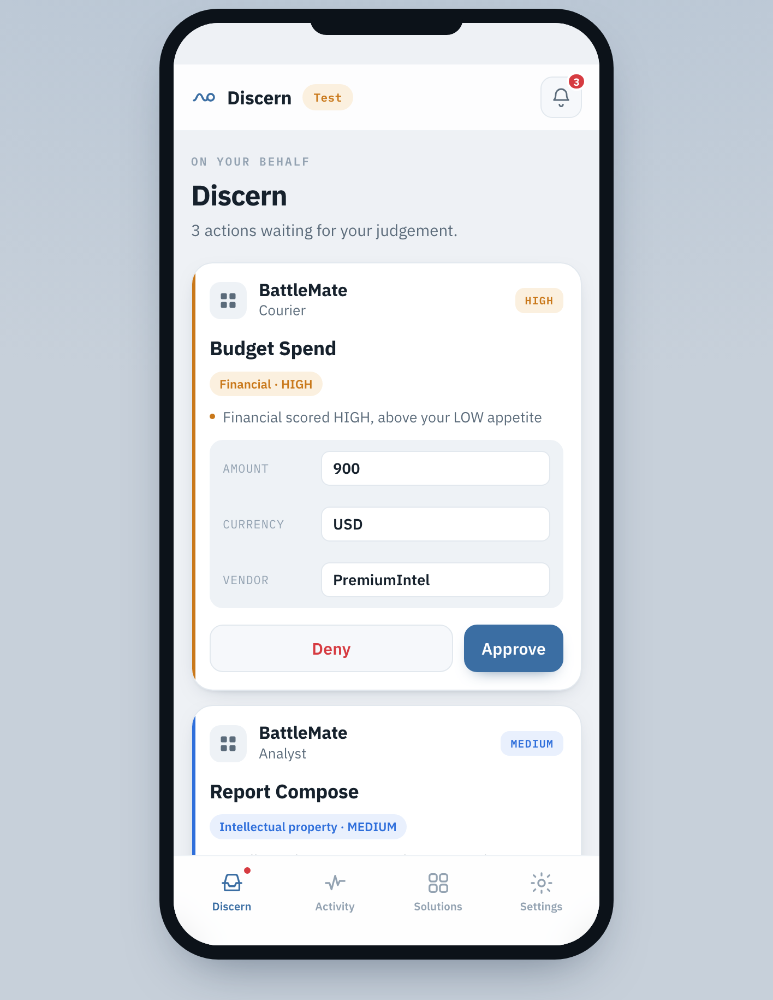

<p align="center">
  
</p>

<h1 align="center">Xurface</h1>

<p align="center">
  <b>The discernment checkpoint between an AI agent's intent and its consequence.</b><br/>
  <i>Beyond human in the loop. Human on the go.</i>
</p>

<p align="center">
  <a href="LICENSE"></a>
  <a href="packages/sdk-typescript"></a>
  <a href="packages/sdk-python"></a>
  <a href="CONTRIBUTING.md"></a>
  <a href="docs/DEVELOPER_GUIDE.md"></a>
</p>

<p align="center">
  <a href="#quickstart">Quickstart</a> &nbsp;·&nbsp;
  <a href="#framework-support">Frameworks</a> &nbsp;·&nbsp;
  <a href="#the-app-people-discern-on">The app</a> &nbsp;·&nbsp;
  <a href="#how-it-works">How it works</a> &nbsp;·&nbsp;
  <a href="#contribute">Contribute</a> &nbsp;·&nbsp;
  <a href="docs/DEVELOPER_GUIDE.md">Developer Guide</a>
</p>

---

AI agents now act for us around the clock. They pay, publish, deploy and delete.
Passwords, passkeys and 2FA answer *"who is this?"*. Nothing answers **"should
this happen?"**

**Xurface sits between an agent and everything it reaches** - its tools, its skills,
its MCP servers, its AI gateway - and governs how it *behaves*. Not the resources:
the agent's use of them. Every skill it runs, every tool or MCP call it makes, every
capability it invokes passes through one guardrail, and that guardrail is set by the
person whose interests are on the line, and enforced in their name.

Concretely: your agent **declares** what it can do; **Horizon scores** the risk of
each action against a standards-based taxonomy; the person sets an **appetite**. At
runtime one call - **`guard`** - records the action on a signed audit ledger and,
when it exceeds what the person tolerates, holds it and pushes it to their phone to
approve, edit or deny. The agent never hard-codes a threshold, and nothing it does
is off the books.

This repo is the **open, developer-facing side**: the SDKs, the six framework
adapters, the Discernment Event spec, and everything you need to add discernment
to an agent in an afternoon - or to add support for one more framework in ~40
lines.

## You already know this model

A phone app **declares** what it can reach - camera, location, contacts. The OS
**classifies** which of those are dangerous, **shows you the list before you install**,
and **stops the app** the first time it actually reaches for one. Sending a message
inside the app is a given; reading your photos is not. The OS sits between the app and
the resource, and the app cannot go around it.

**Xurface is that surface, for AI agents.**

| On your phone | With Xurface |
|---|---|
| The app manifest declares its permissions | The agent **declares** its skills, tools and capabilities |
| The OS marks them normal vs dangerous | **Horizon scores** each one against a risk taxonomy |
| You see the permission list **before** installing | You **review what it can do before you connect it** |
| "Allow X to use your location?" | A **Discern card**: approve, **edit the values**, or deny |
| Normal permissions just work | Routine actions pass - and are **logged** |
| Revoke in Settings, anytime | Per-category **appetite** + **pause / revoke**, anytime |

One difference matters: a phone asks about **resources**. Xurface asks about **what the
agent does with them** - and it asks even when the solution would happily allow it,
because the floor belongs to the person, not the developer.

## What the SDK does

Two jobs. That is the whole developer surface.

1. **Declare the manifest.** `declareAgent()` tells Horizon what this agent can do.
   Horizon scores every ability against the taxonomy. You never pick a threshold, and
   you cannot under-rate an action - a developer risk hint can only raise a score.
2. **Route every consequential access through the checkpoint.** `guard()` wraps the
   moment the agent reaches for something. Inside the person's appetite it returns
   instantly and is logged; above it, it holds, pushes to their phone, and waits.

Use an adapter and job 2 becomes automatic for **every tool call, MCP call or gateway
call** your agent makes - your tool bodies never change.

What you get without building it: a signed, hash-chained **audit trail** of everything;
per-category **appetite**; **edit-before-approve**; a **kill switch**; and two isolated
environments to test in.

## Quickstart

```bash
npm install xurface          #  or:  pip install xurface
```

Declare once; Horizon scores every ability. Then guard the actions that matter.

```js
import { Xurface } from "xurface";

const xf = new Xurface({ clientId, clientSecret });   // add env: "test" to build safely first

await xf.declareAgent("apply-bot", {
  display_name: "Apply Bot",
  abilities: [
    { key: "offers.scan", kind: "skill", description: "Scan the inbox for job offers" },
    { key: "pay.invoice", kind: "capability", description: "Pay an invoice",
      developer_risk: { financial: "HIGH" } },
  ],
});

const user = await xf.resolveUser("email", "ada@example.com");

const verdict = await xf.guard({
  user, agent: "apply-bot", capability: "pay.invoice",
  details: { amount: 2400 }, wait: 120000,       // block up to 2 min for a human decision
});

if (verdict.allowed) await reallyPay(verdict.details);   // details may be the person's edits
else console.log("not allowed:", verdict.state, verdict.reasons);
```

- **Within appetite** -> `allowed` instantly, and logged.
- **Above appetite / SEVERE / developer `always`** -> held, pushed to the person's
  phone; `guard` waits for their approve / edit / deny.
- The person can **edit** your arguments before approving; you get the edited values.

Same shape in Python (`xf.guard(user=..., agent=..., capability=..., wait_ms=...)`).
Full walk-through in the **[Developer Guide](docs/DEVELOPER_GUIDE.md)**.

## Framework support

Your agent already calls tools through a framework. Use the matching adapter and
your tool bodies do not change - a held or denied call comes back as an ordinary
tool result the model can read.

| Framework | Kind | Import |
|---|---|---|
| **OpenAI** (function / tool calling, Agents SDK) | genAI | `xurface/openai` · `xurface.adapters.openai` |
| **Anthropic Claude** (tool use, Claude Agent SDK) | genAI | `xurface/anthropic` · `xurface.adapters.anthropic` |
| **Google Gemini** (function calling) | genAI | `xurface/gemini` · `xurface.adapters.gemini` |
| **LangChain / LangGraph** | genAI orchestration | `xurface.adapters.langgraph` |
| **CrewAI** | multi-agent | `xurface.adapters.crewai` |
| **MCP** — Claude Code, Cursor, Zed, Windsurf | coding | `xurface/mcp-server` |

```js
import { createOpenAIGuard } from "xurface/openai";
const guard = createOpenAIGuard(xf, { user, agent: "apply-bot", wait: 120000 });
const reg = guard.register(tools);           // your tools, unchanged
for (const call of message.tool_calls) toolMessages.push(await reg.dispatch(call));
```

For coding agents, it's one MCP entry (Claude Code `.mcp.json`) and the agent routes
its deploys, deletes, force-pushes and spends through your phone. See
[`integrations/`](integrations/README.md).

## The app people discern on

**Xurface Discern** is the phone (and tablet, and laptop) app where a person
approves, edits or denies what your agent wants to do - one inbox for every agent
from every developer.

<p align="center">
  
</p>

> **Try the live app:** [xurface.500xlaunch.com/app](https://xurface.500xlaunch.com/app) —
> sign in, connect a solution from the catalog, and approve or deny what it wants to
> do, live. It ships cross-platform (Android, iOS, macOS, Windows) from one codebase:
> [500xlaunch-org/discern](https://github.com/500xlaunch-org/discern).

## How it works

```
Developers  ->  Horizon  ->  People
```

- **Developers** onboard an **Agentic Solution**. Agents self-declare their
  skills, tools and capabilities; **Horizon scores** each against a NIST/ISO-mapped
  risk taxonomy. You never set a threshold.
- **Horizon** reconciles each action's score with the person's **appetite**, with
  the person as the floor of protection. Routine actions pass and are logged on a
  signed, hash-chained ledger; risky ones wait for a human. Abuse is contained;
  gaps are analysed after the fact.
- **People** get one inbox, **Xurface Discern**, for every agent. They approve,
  edit or deny, set how much they want to be asked, and can flag or report anything.
  Their judgement stays theirs.

### Test before you go live

Horizon runs two isolated environments in one deployment, **test** and **live**.
Build and try an agent in test - its own solutions, links, intents and audit chain -
then roll out unchanged. One option:

```js
new Xurface({ clientId, clientSecret, env: "test" });   // live is the default
```

### A two-sided market that compounds

Developers bring Agentic Solutions that ask for discernment. People bring their
identity, credentials and judgement. Horizon links the two and keeps the record.
Every developer who onboards gives people one more reason to carry Xurface Discern;
every person makes the audience a developer can reach a little larger.

> **More developers, more people. More people, more developers.** Contributing here
> is how you push that loop.

## Risk and appetite

Every ability, and every runtime action, is scored across **identity, financial,
location, intellectual, conversation, data, systems** (mapped to NIST 800-53/63 and
ISO/IEC 27001/27701, see [`spec/risk-scoring.md`](spec/risk-scoring.md)). The
action's severity is the highest category it touches.

| Severity | Typical actions | Default |
|---|---|---|
| **Low** | read, search, list | passes, logged |
| **Medium** | draft, small spend, routine messaging | passes, logged |
| **High** | send, publish, pay, deploy, connect a credential | waits for the human |
| **Severe** | delete, change access or credentials | waits, biometric, never delegated |

No fixed threshold. The person's **appetite** (the severity they let pass, per
category) is the floor: a developer can ask for more discernment, never quietly
less. See [`spec/discernment-appetite.md`](spec/discernment-appetite.md).

## Contribute

Xurface gets better the more the ecosystem builds on it, and the loop above means
every good contribution reaches more people. The highest-leverage PR is a **new
framework adapter** - about 40 lines, because all the risk logic lives in Horizon.

Three steps, and CI proves it:

1. **Copy the worked example.** Gemini was added exactly the way a contribution is:
   [`packages/sdk-typescript/adapters/gemini.mjs`](packages/sdk-typescript/adapters/gemini.mjs)
   (or the Python `gemini.py`). Map your framework's tool calls onto `runGuarded`.
2. **Pass the adapter contract test** - offline, no Horizon needed. An *allowed*
   capability runs the tool; a *held/denied* one does not; it guards with the right
   capability and args.
   [`test/adapter-contract.test.mjs`](packages/sdk-typescript/test/adapter-contract.test.mjs)
   (`node --test test/`) / `packages/sdk-python/test/adapter_contract.py`.
3. **Open a PR** with the adapter, its contract case, and a line in the table above.

**Why it is worth your afternoon:** every agent built on your framework gets these
guardrails for free, your adapter ships in the next release, and the framework table
above carries your name.

Other great first PRs: a new **SDK language**, a **risk rule pack** for a domain, an
**event transport**, an **agent skill**, a runnable **example Solution**. Full
guide in [CONTRIBUTING.md](CONTRIBUTING.md). Be excellent to each other - this is a
fun mission: trustworthy agents for everyone.

## What's in here

```
packages/sdk-typescript   xurface — client, consumer, 4 adapters + an MCP server (ESM, Node 18+)
packages/sdk-python       xurface — client, consumer, 5 adapters (stdlib only, Python 3.10+)
examples/                 runnable scenarios: a coding agent, payments, support, devops
integrations/             activate Xurface across coding agents and frameworks
registry/                 the public SDK registry (add yours by PR)
skills/                   the coding-agent skill (Claude Code, Cursor, ...)
spec/                     Discernment Event, Solution Manifest, risk scoring, roles, OpenAPI
toolkit/                  create-xurface-sdk scaffolder + how to submit
docs/                     the Developer Guide
```

Run the tests: `cd packages/sdk-typescript && node --test test/` and
`python3 packages/sdk-python/test/adapter_contract.py`. Both are green in CI on every push.

## Community, security, license

- Questions or ideas: `digital@500xlaunch.com`. A star helps other developers find it.
- Security: follow [SECURITY.md](SECURITY.md); do not open a public issue for vulnerabilities.
- **Apache-2.0**, with an explicit patent grant - the interface is open on purpose:
  use it, implement it, extend it. The running Horizon platform, its infrastructure
  and the app are separate and not in this repository. See [LICENSE](LICENSE) / [NOTICE](NOTICE).

Xurface is a product of [500xLaunch](https://500xlaunch.com).
