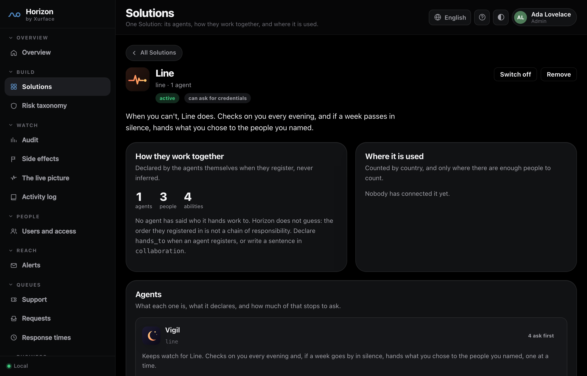
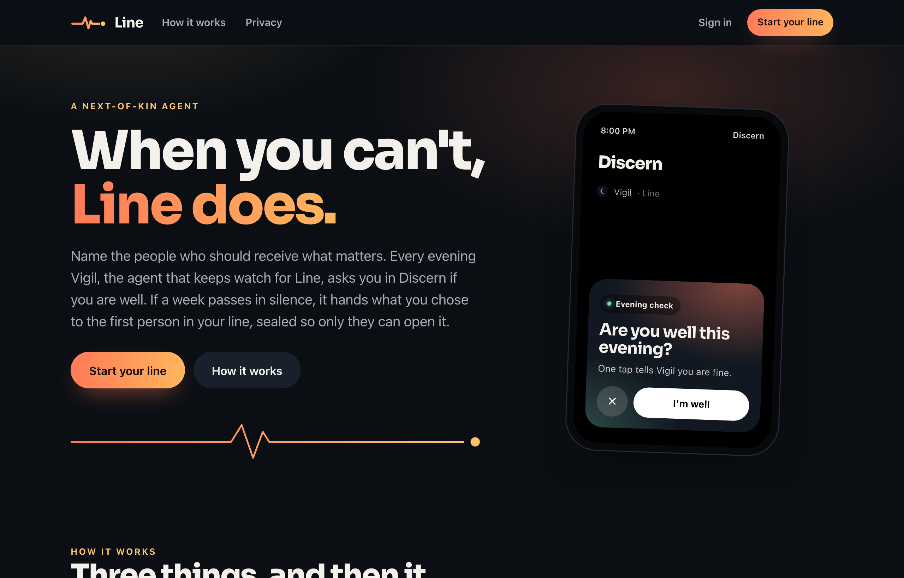
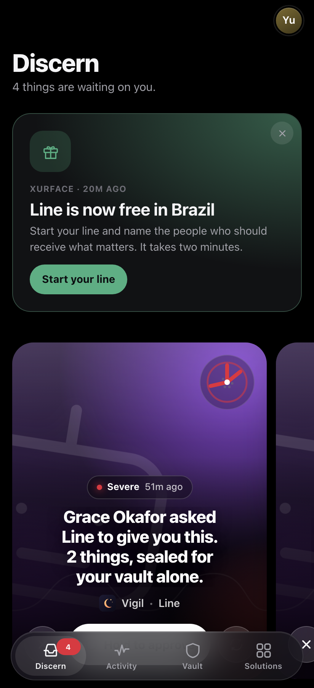
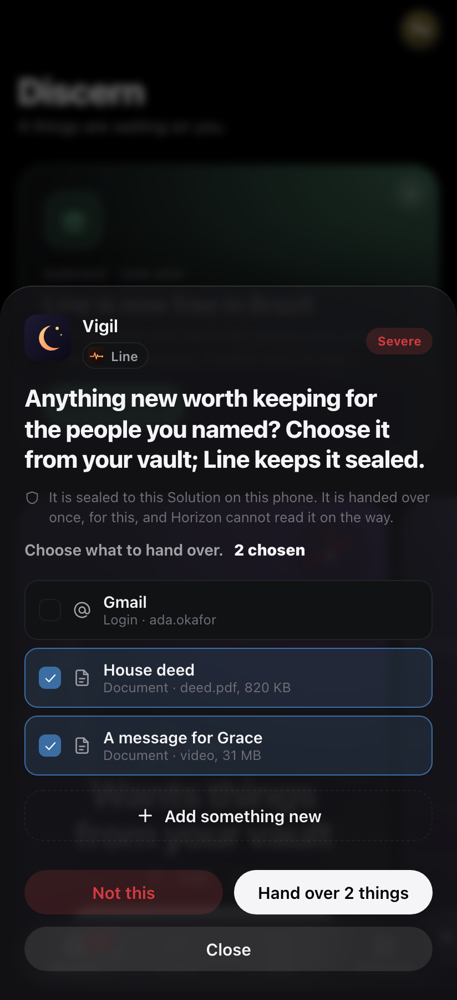

<p align="center">
  
</p>

<h1 align="center">Xurface</h1>

<p align="center">
  <b>The discernment checkpoint between an AI agent's intent and its consequence.</b><br/>
  <i>Beyond human in the loop. Human on the go.</i>
</p>

<p align="center">
  <a href="LICENSE"></a>
  <a href="packages/sdk-typescript"></a>
  <a href="#built-with-xurface-line"></a>
  <a href="CONTRIBUTING.md"></a>
  <a href="docs/DEVELOPER_GUIDE.md"></a>
</p>

<p align="center">
  <a href="#the-platform">The platform</a> &nbsp;·&nbsp;
  <a href="#built-with-xurface-line">Line, a real Solution</a> &nbsp;·&nbsp;
  <a href="#use-it">Use it</a> &nbsp;·&nbsp;
  <a href="#contribute">Contribute</a> &nbsp;·&nbsp;
  <a href="docs/DEVELOPER_GUIDE.md">Developer Guide</a>
</p>

---

AI agents now act for us around the clock. They pay, publish, deploy, delete, and
hold things we would never leave lying around. Passwords, passkeys and 2FA answer
*"who is this?"*. Nothing answers **"should this happen?"**

**Xurface answers it.** Your agent declares what it can do. Horizon scores the risk
of every action against a published, standards-backed taxonomy. The person sets how
much they let pass. Everything is written to a signed record, and anything above
their line stops and waits for them, on their phone, with the agent's own words,
the risk, and what happens if they say nothing.

It works at the level of the **Solution**, not the model. Claude, GPT, Gemini or your
own: every agent asks the same way and is answered the same way.

## You already know this model

A phone app **declares** what it can reach. The OS **classifies** what is dangerous,
**shows you the list before you install**, and **stops the app** the first time it
reaches for something sensitive. **Xurface is that surface, for AI agents**, with one
difference that matters: a phone asks about resources; Xurface asks about **what the
agent does with them**, and the floor belongs to the person, not the developer.

| On your phone | With Xurface |
|---|---|
| The manifest declares permissions | The agent **declares** its skills, tools and capabilities |
| The OS marks them normal or dangerous | **Horizon scores** each against the risk taxonomy |
| You see the list **before** installing | You **read everything it can do before you connect it** |
| "Allow X to use your location?" | A **Discern** request: approve, **edit the values**, or deny |
| Normal permissions just work | Routine actions pass, and are **logged** |
| Revoke in Settings | Per-area **appetite**, **pause**, **revoke**, any time |

## The platform

Three parts, one loop: **Developers -> Horizon -> People.**

<table>
<tr>
<td width="50%" valign="top">

**Horizon** is where Solutions live. Agents register and declare what they can do;
Horizon scores every action across seven areas (identity, money, location,
intellectual property, conversation, data, systems), backed by NIST, ISO/IEC, PCI DSS
and GDPR controls that are explained in plain words, and extensible with your own
sources. It keeps a signed, hash-chained record of everything, holds what needs a
person, and shows the owner and the platform what each Solution is built with.

</td>
<td width="50%" valign="top">

**Xurface Discern** is where people answer: one inbox for every agent from every
developer, on Android, the web, and soon iOS. It shows who is asking, in their own
words, how serious it is and what happens if nothing is done. It holds a **vault**
that lives only on the phone (logins, cards, documents, photos, videos), from which
a person hands an agent exactly what they choose, sealed so that not even Horizon
can read it.

</td>
</tr>
</table>

<p align="center">
  
</p>

**This repository** is the open side: the SDKs, the framework adapters, the
specification, and the examples. Everything here is Apache-2.0.

## Built with Xurface: Line

<p align="center">
  
</p>

**[Line](https://line.500xlaunch.com)** is the first real Solution on Xurface. Its own code
is private; the excerpts below show how it uses this SDK.

*When you can't, Line does.* You name the people who should receive what matters, in
order. Every evening Line's agent, **Vigil**, asks you in Discern whether you are
well. Now and then it asks what to keep from your vault. If a week passes in
silence (and you were not seen in Discern, and did not say you were away), you are
written to, given notice, and only then does Line reach the first person you named,
and hand them what you chose, sealed to their own vault.

It is a hard case on purpose: money, identity and the most private documents a
person has, an agent that acts when the person cannot, and a mistake that would be
unforgivable. Every one of those moments goes through Xurface.

<table>
<tr>
<td width="50%" align="center"><br/><sub>Vigil in Discern: who is asking, how serious, in its own words</sub></td>
<td width="50%" align="center"><br/><sub>Choosing what Line keeps, sealed on the phone before it leaves</sub></td>
</tr>
</table>

### How Line uses the SDK

Line talks to Horizon only through the SDK, and everything it needed and did not
find there, it contributed back (SDK 1.1 to 1.3).

**1. Declare the agent, once, on every start.** Name, face, everything it can ever do,
and where the Solution lives. People read this list before they connect.

```js
await xf.declareAgent("line", {
  display_name: "Vigil",
  description: "Keeps watch for Line. Checks on you every evening and, if a week goes by in silence, hands what you chose to the people you named.",
  logo: VIGIL_MARK,                                    // https or a small data:image
  solution: { publisher: "500xLaunch", homepage: "https://line.500xlaunch.com",
              connect_url: "https://line.500xlaunch.com/" },   // people connect by signing in here
  abilities: [
    { key: "heartbeat.confirm", kind: "capability", discernment: "always",
      description: "Ask you, once an evening, whether you are well" },
    { key: "vault.keep", kind: "capability", discernment: "always",
      description: "Ask which things from your vault Line should keep for the people you named",
      developer_risk: { identity: "SEVERE", financial: "SEVERE", data: "SEVERE" } },
    { key: "presence.read", kind: "capability",
      description: "Know when you last opened Discern, to the hour and nothing more" },
    { key: "vault.deliver", kind: "capability", discernment: "always",
      description: "Hand what you chose to the person you named, sealed to their own vault" },
  ],
});
```

**2. Connect people by having them sign in.** Discern opens Line's sign-in with a
short-lived session; Line signs the person in with its own passkey and finishes it.
No address is matched, so a Line account under any email connects.

```js
const { user } = await xf.connectComplete(req.query.xurface_session);   // the pairwise id Line keeps
```

**3. Ask, and let it wait.** A question that can wait a day, with what happens if it
is not answered. Taken back when it no longer matters.

```js
const it = await xf.ask({ user, agent: "line", capability: "heartbeat.confirm", ttlHours: 24,
  summary: "Ada, are you well this evening? One tap tells Vigil you are fine.",
  if_blocked: "Line keeps asking, and after a week begins handing over to the people you named." });
await xf.push(it.id);
// later: (await xf.intent(it.id)).state, or xf.withdraw(it.id)
```

**4. Ask for things from the vault, sealed to you.** The person chooses on their phone;
what arrives is encrypted to Line's release key and can be collected once.

```js
const ask = await xf.requestCredential({ user, agent: "line", type: "bundle", ttlHours: 24,
  reason: "Anything new worth keeping for the people you named?" });
const envelope = await xf.collect(ask.id);   // ECDH P-256, HKDF, AES-256-GCM; Horizon never sees inside
```

**5. Hand it over, sealed to the person receiving it.**

```js
const { key } = await xf.receiveKey(kin);                        // their vault's public key
await xf.deliver({ user: kin, agent: "line", title: "From Ada", from: "Ada Okafor",
  count: 2, reason: "Ada asked Line to give you this.", envelope: sealTo(key, items) });
```

**6. Do not mistake a busy week for silence.** One tap anywhere in Discern counts.

```js
const { seen_at } = await xf.presence(user);   // the hour they last used Discern, nothing else
```

Line's whole life cycle (sign up, connect, keep, a week of silence, notice, hand over
to the first person, move on to the next, accepted, erased) runs end to end against a
real Horizon in its repository: `node tools/e2e.mjs`.

## Use it

```bash
npm install xurface        # TypeScript / JavaScript, no dependencies
pip install xurface        # Python, standard library only
```

The newest TypeScript SDK (1.3) is always in [`packages/sdk-typescript`](packages/sdk-typescript)
and is also served by every Horizon at `/sdk/xurface.mjs`; the npm and PyPI releases
follow it.

1. **Register a Solution** in the Horizon console (`xurface.500xlaunch.com`), and keep
   its client id and secret. Build in the **test** environment first:
   `new Xurface({ clientId, clientSecret, env: "test" })`.
2. **Declare your agents** with `declareAgent`. Horizon answers with the score of every
   ability; you never pick a threshold, and a risk hint can only raise a score.
3. **Connect people**, by declaring a `connect_url` (they sign in to you from Discern)
   or by `discover` with an address they confirm in Discern.
4. **Guard what matters.** `guard` records the action and, above the person's appetite,
   holds it until they answer. For questions that can wait hours or days, `ask`.
5. **Use the vault** only with `requestCredential`, `collect`, `receiveKey`, `deliver`:
   nothing in it is ever readable by Horizon.

```js
import { Xurface } from "xurface";
const xf = new Xurface({ clientId, clientSecret });

const verdict = await xf.guard({ user, agent: "apply-bot", capability: "pay.invoice",
  details: { amount: 2400 }, wait: 120000 });
if (verdict.allowed) await reallyPay(verdict.details);   // details may carry the person's edits
```

### Framework support

Use the adapter for your framework and your tool bodies do not change; a held or
denied call comes back as an ordinary tool result.

| Framework | Import |
|---|---|
| **OpenAI** (tool calling, Agents SDK) | `xurface/openai` · `xurface.adapters.openai` |
| **Anthropic Claude** (tool use, Claude Agent SDK) | `xurface/anthropic` · `xurface.adapters.anthropic` |
| **Google Gemini** (function calling) | `xurface/gemini` · `xurface.adapters.gemini` |
| **LangChain / LangGraph** | `xurface.adapters.langgraph` |
| **CrewAI** | `xurface.adapters.crewai` |
| **MCP** (Claude Code, Cursor, Zed, Windsurf) | `xurface/mcp-server` |

Every call names the SDK version and the adapter it went through, so your Solution's
page in Horizon shows what it is built with, and the platform sees which adapters
carry which Solutions.

## Risk and appetite

| Severity | Typical actions | By default |
|---|---|---|
| **Low** | read, search, list | passes, logged |
| **Medium** | draft, small spend, routine messages | passes, logged |
| **High** | send, publish, pay, deploy, connect a credential | waits for the person |
| **Severe** | delete, change access, hand over secrets | waits, with a face or fingerprint, never delegated |

The person's **appetite** (what may pass, per area) is the floor: a Solution can start
its people more carefully than the platform, never less, and a developer can ask for
more discernment, never quietly less. See [`spec/risk-scoring.md`](spec/risk-scoring.md)
and [`spec/discernment-appetite.md`](spec/discernment-appetite.md).

## Contribute

Xurface gets better the more the ecosystem builds on it. Good first contributions:

- **A framework adapter**, about 40 lines, because the risk logic lives in Horizon.
  Copy [`adapters/gemini.mjs`](packages/sdk-typescript/adapters/gemini.mjs), pass the
  offline [adapter contract test](packages/sdk-typescript/test/adapter-contract.test.mjs),
  open a PR with a line in the table above.
- **Bring the Python SDK level with TypeScript 1.3**: `ask`, `intent`, `push`,
  `withdraw`, `requestCredential`, `collect`, `receiveKey`, `deliver`, `presence`,
  `connectComplete`. Each is one HTTP call; the TypeScript file is the reference.
- **A Solution of your own.** Line is the pattern: declare, connect, ask, keep, deliver.
  Tell us and it joins the list below.
- **A risk source** for your domain (a regulation, a sector standard): Horizon shows
  exactly what it would change before it applies.
- A new **SDK language**, an **event transport**, an **agent skill**.

Tests: `cd packages/sdk-typescript && node --test test/` and
`python3 packages/sdk-python/test/adapter_contract.py`. Full guide in
[CONTRIBUTING.md](CONTRIBUTING.md) and the [Developer Guide](docs/DEVELOPER_GUIDE.md).

### Solutions built with Xurface

| Solution | What it does | Source |
|---|---|---|
| **[Line](https://line.500xlaunch.com)** | A next-of-kin agent: checks on you every evening, hands what you chose to the people you named | Private |

## What is in here

```
packages/sdk-typescript   xurface 1.3: client, consumer, 4 adapters and an MCP server (ESM, Node 18+)
packages/sdk-python       xurface: client, consumer, 5 adapters (standard library, Python 3.10+)
examples/                 runnable scenarios: a coding agent, payments, support, devops
integrations/             Xurface across coding agents and frameworks
registry/                 the public SDK registry (add yours by PR)
skills/                   the coding-agent skill (Claude Code, Cursor, ...)
spec/                     Discernment Event, Solution Manifest, risk scoring, roles, OpenAPI
toolkit/                  create-xurface-sdk scaffolder
docs/                     the Developer Guide
```

## Community, security, license

- Questions or ideas: `digital@500xlaunch.com`. A star helps other developers find it.
- Security: follow [SECURITY.md](SECURITY.md); never open a public issue for a vulnerability.
- **Apache-2.0**, with an explicit patent grant. The interface is open on purpose: use
  it, implement it, extend it. The running Horizon platform and the Discern app are
  separate and not in this repository. See [LICENSE](LICENSE) and [NOTICE](NOTICE).

Xurface is a product of [500xLaunch](https://500xlaunch.com).
